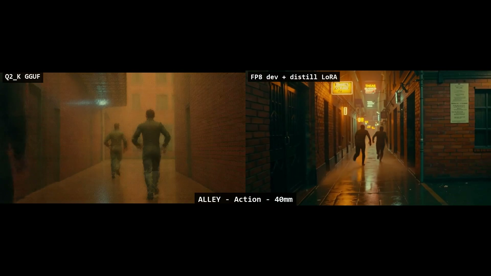

<div align="center">

# 🎬 Cinema Worldbuilder

### ComfyUI custom-node pack + empirical prompt-sensitivity study for **LTX 2.3** video generation

[](LICENSE)
[](https://github.com/Pro2004-a11/comfyui-cinema-worldbuilder/releases)
[](https://github.com/comfyanonymous/ComfyUI)
[](https://github.com/Lightricks/ComfyUI-LTXVideo)
[](https://www.python.org/)
[](tests/)

**Three V3 ComfyUI nodes** that compose a disciplined cinematic prompt
(five camera modes × canonical lens recipes × diegetic-audio guardrails) and
drive LTX 2.3 22B distilled video generation. Plus the controlled sweep
methodology, the **3 LTX 2.3 prompt-sensitivity findings** they uncovered, and
ready-to-run example workflows for t2v, i2v, v2v, and hi-res 1080p production.

</div>

---

## 🎥 Demo

<div align="center">

https://github.com/Pro2004-a11/comfyui-cinema-worldbuilder/releases/download/v0.2.0/q2k_vs_fp8_full_reel.mp4

[](https://github.com/Pro2004-a11/comfyui-cinema-worldbuilder/releases/download/v0.2.0/q2k_vs_fp8_full_reel.mp4)

**[▶️ Watch the full A/B reel (1:47, 45 MB)](https://github.com/Pro2004-a11/comfyui-cinema-worldbuilder/releases/download/v0.2.0/q2k_vs_fp8_full_reel.mp4)**

</div>

> **Q2_K GGUF (left) vs FP8 dev + distill LoRA (right)** — same Cinema Worldbuilder prompts, two LTX 2.3 model variants. 2 scenes × 5 camera modes = 10 paired clips. The fp8 dev + distill LoRA chain matches the **Comfy-Org canonical template** and is the recommended production path on a 12 GB GPU.

---

## ✨ What it is

The pack ships three ComfyUI nodes under the `Cinema Worldbuilder` category:

| Node | What it does |
|------|--------------|
| 🎥 **`CinemaWorldbuilder_CameraBlock`** | Picks a film **mode** (M1 Narrative / M2 Studio / M3 Action / M4 Performance / M5 Atmospheric), a **lens** (35–85 mm), a **runtime** (0.5–4.0 s), and emits a canonical camera-vocabulary block. Outputs `(camera_block, frame_count, fps, runtime_actual)` — the frame count is LTX-valid `8k+1` and respects a 12 GB VRAM cap. |
| 🔊 **`CinemaWorldbuilder_AudioLine`** | Builds the diegetic audio line. **Music is rejected at validation** — any music/score/lyrics token fails the graph (prevents bad prompts from wasting renders). Optional `spoken_dialogue` clause. |
| 📝 **`CinemaWorldbuilder_PromptComposer`** | Assembles the final single-paragraph prompt from `style_and_mood + dynamic_description + static_description + camera_block + audio_line` and feeds `CLIPTextEncode`. |

**Typical wiring:** `CameraBlock` + `AudioLine` → `PromptComposer` → `CLIPTextEncode (positive)` → LTX 2.3 sampler.

## 🔬 What we learned (the headline)

Three findings from a controlled 26-pair A/B sweep on LTX 2.3 22B distilled
1.1, evidence in [`FINDINGS_FOR_LTX.md`](FINDINGS_FOR_LTX.md):

1. **Equipment vocabulary is decorative** — compressing the camera/lens block by **−48%** (180 → 94 words) produces visually indistinguishable output. CLIP image-embedding cosine similarity: **0.967 ± 0.071 paired** vs **0.699 ± 0.076 control** (≈ 3.5σ effect size). Arri / Master Primes / ND filter indices: not interpreted by the model.
2. **`static_description` is load-bearing** — the camera-vocabulary phrasing applies a *grade* (palette, motion vocabulary, stage lighting); it does **not** carry scene content. Strip the scene noun and even rich camera prompts collapse to abstract lens-mush.
3. **`LTXVScheduler` defaults leave the distilled-1.1 schedule undenoised** — output looks soft and grainy. The clean fix is a `ManualSigmas` schedule from the Lightricks 1.1 reference; details in the writeup.

## 📦 Install

```bash
# Drop into ComfyUI's custom_nodes folder
cd ComfyUI/custom_nodes
git clone https://github.com/Pro2004-a11/comfyui-cinema-worldbuilder.git
```

Restart ComfyUI. On load you should see `comfyui-cinema-worldbuilder` in the
console with no `IMPORT FAILED`. If a workflow says "Installation Required" for
the Cinema nodes, hard-refresh the browser tab (Ctrl+F5) — the frontend caches
its node list at page load.

**No third-party Python dependencies.** Tests: `python -m pytest tests/ -v` (20 unit tests, all green).

## 🎛️ Example workflows

In `example_workflows/` — each pipeline in two formats: `*.json` (API, for
headless submission) and `*_ui.json` (graph format, open in the ComfyUI canvas).

| Workflow | Pipeline | Notes |
|----------|----------|-------|
| **[`cinema_ltx23_t2v_hires_fp8.json`](example_workflows/cinema_ltx23_t2v_hires_fp8.json)** | **Hi-res t2v + i2v** (recommended) | Built on the **Comfy-Org canonical template** — two-stage 540p draft → spatial upscale → 1088p refine. Cinema nodes drive the positive prompt. Uses `ltx-2.3-22b-dev-fp8.safetensors` + distill LoRA. Output: 1280×704–1920×1088 @ 24 fps with audio, ≈ 5 s clip, ≈ 290 s wall time on RTX 4070 Ti. |
| [`cinema_ltx23_t2v.json`](example_workflows/cinema_ltx23_t2v.json) + [`_ui`](example_workflows/cinema_ltx23_t2v_ui.json) | Single-stage t2v | Faster (≈ 75 s wall), 768×512. Good for sweeps and iteration. |
| [`cinema_ltx23_i2v.json`](example_workflows/cinema_ltx23_i2v.json) + [`_ui`](example_workflows/cinema_ltx23_i2v_ui.json) | First-frame image-to-video | `LoadImage` anchor via `LTXVAddGuide(frame_idx=0, strength=1.0)`. CFGGuider's pos/neg pull from AddGuide outputs (the i2v anchor point), not raw `LTXVConditioning`. |
| [`cinema_ltx23_v2v.json`](example_workflows/cinema_ltx23_v2v.json) + [`_ui`](example_workflows/cinema_ltx23_v2v_ui.json) | Video-to-video refine | Adapted from a known-good warp-refine graph. Useful for upgrading rough drafts. |

Load any `*_ui.json` in the ComfyUI canvas, edit the Cinema node widgets, hit Queue.

### Required models

The recommended hi-res workflow needs:

| File | Folder | Source |
|------|--------|--------|
| `ltx-2.3-22b-dev-fp8.safetensors` | `models/checkpoints/` | the LTX 2.3 dev base in fp8 (matches the Comfy-Org canonical template) |
| `ltx-2.3-22b-distilled-lora-384-1.1.safetensors` | `models/loras/ltxv/ltx2/` | [`Lightricks/LTX-2.3`](https://huggingface.co/Lightricks/LTX-2.3) on HuggingFace |
| `ltx-2.3-spatial-upscaler-x2-1.1.safetensors` | `models/latent_upscale_models/` | [`Lightricks/LTX-2.3`](https://huggingface.co/Lightricks/LTX-2.3) |
| `gemma-3-12b-it-IQ4_XS.gguf` + `ltx-2.3_text_projection_bf16.safetensors` | `models/text_encoders/` | [`Kijai/LTX2.3_comfy`](https://huggingface.co/Kijai/LTX2.3_comfy) |
| `ltx23_video_vae.safetensors` + `ltx23_audio_vae.safetensors` | `models/vae/` | [`Kijai/LTX2.3_comfy`](https://huggingface.co/Kijai/LTX2.3_comfy) |

The non-hires `cinema_ltx23_t2v.json` workflow uses the GGUF chain instead (`UnetLoaderGGUF` + Q2_K) — lighter requirements, included for completeness.

## 🎬 The five camera modes

Each mode emits a canonical camera-vocabulary block — palette, motion vocabulary, stage lighting cue, focal-length suggestion. The grammar is intentionally short by design (see Finding 1) — motion / lighting / lens / palette / DoF.

| Mode | Register | Default lens | Best for |
|------|----------|-------------|----------|
| **M1 Narrative** | Cinematic push-in, moody, character-focused | 55 mm | A lone subject in a place; story-driven shots |
| **M2 Studio** | Editorial fashion film, glossy, high-key, photoreal skin | 75 mm | Portraits, product, fashion |
| **M3 Action** | Gritty documentary realism, fast handheld, motion blur | 40 mm | Combat, sports, kinetic scenes |
| **M4 Performance** | Stage-grade with audience implied, lighting wash, energy | 55 mm | Dancers, athletes, music-video subjects |
| **M5 Atmospheric** | Environment plate, slow drift, still and quiet, no subject | 35 mm | Establishing shots, empty interiors, mood-only |

> ⚠️ **`static_description` is load-bearing** (Finding 2). Camera grammar is a *grade* layer, not a content carrier. The mode shifts the look; the prose carries the scene. Empty or vague scene descriptions collapse silently.

## 🧪 Reproduce the sweep

```bash
# Validate the 28-job matrix without rendering
python sweep/cinema_sweep_v2.py --check

# Full sweep (≈ 30 min on RTX 4070 Ti)
python sweep/cinema_sweep_v2.py

# Build the 26-pair side-by-side A/B reel
python sweep/ab_compare.py

# CLIP-similarity on the 26 pairs (≈ 1 min on GPU)
python sweep/clip_similarity.py
```

Outputs land in `sweep/results/`, `sweep/results_v2/`, and `sweep/results_ab/`. The per-clip CLIP-similarity table is written to `sweep/results_v2/clip_similarity.json`.

## 🗂️ Repo layout

```
comfyui-cinema-worldbuilder/
├── 📄 FINDINGS_FOR_LTX.md      # the writeup — empirical study of LTX 2.3
├── 📄 LINKEDIN_POST.md          # social post draft for the findings
├── 🧩 cinema_grammar.py         # mode tables, camera blocks, prompt composer (pure functions, no ComfyUI import)
├── 🧩 nodes.py                  # the 3 io.ComfyNode adapters
├── 🧪 tests/                    # 20 pytest unit tests
├── 🎛️ example_workflows/        # 4 pipelines × API + UI formats
├── 🔬 sweep/                    # methodology: matrix builder, CLIP-sim script, A/B compositor
└── 📚 docs/                     # design spec + implementation plan
```

## 🤝 Contributing

Corrections, replications on other LTX 2.3 configurations, and PRs to extend the
camera-grammar vocabulary or audio-discipline rules are welcome. Open an issue
before substantial changes so we can chat about scope.

## 📜 Citation

If this pack or the writeup informs your work:

```bibtex
@misc{refaeli2026cinemaworldbuilder,
  author = {Refaeli, Yosi},
  title  = {Cinema Worldbuilder: ComfyUI nodes and prompt-sensitivity study for LTX 2.3},
  year   = {2026},
  url    = {https://github.com/Pro2004-a11/comfyui-cinema-worldbuilder}
}
```

## 📬 Contact

Feedback welcome on [LinkedIn](https://www.linkedin.com/) or via [GitHub issues](https://github.com/Pro2004-a11/comfyui-cinema-worldbuilder/issues).

---

<div align="center">

Made with discipline by a senior technical artist. 🎬

</div>
